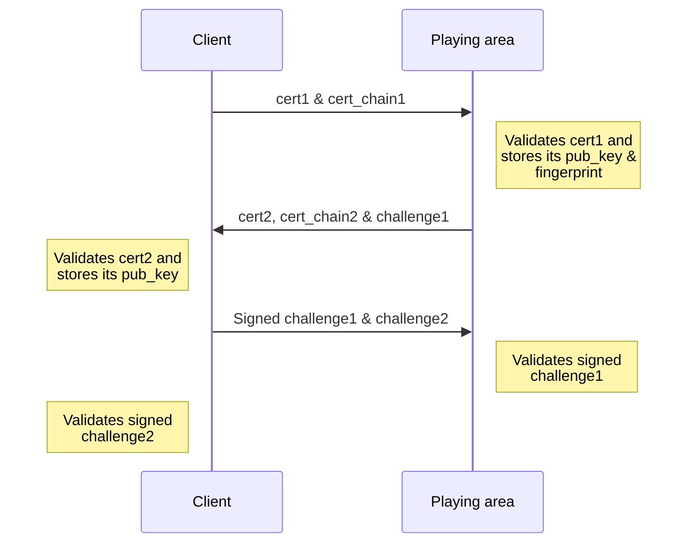
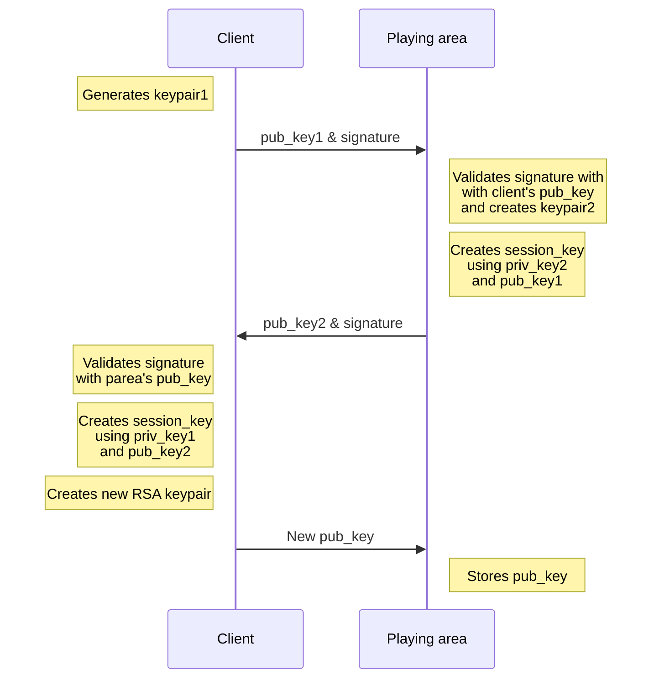
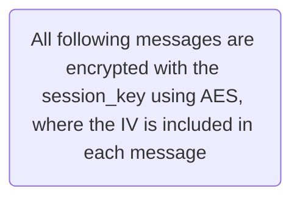

# Bingo

 

## Table of Contents

* [Description](#description)
* [Authorization](#authorization)
    * [Identification](#identification)
    * [Authentication](#authentication)
* [Authors](#authors)

 

## Description

This project consists of a secure bingo game, where the players need to go through a process of authorization to be able to play. 

There are three main entities: the [caller](https://github.com/detiuaveiro/assignment-2---bingo-8/tree/main/caller), the [player](https://github.com/detiuaveiro/assignment-2---bingo-8/tree/main/player) and the [playing area](https://github.com/detiuaveiro/assignment-2---bingo-8/tree/main/playing-area).

The playing area is the entity that is in charge of [authorizing](#authorization) all users and granting them access to the game, acting as a playing field throughout. 

The caller acts as the game host, making sure the game is played correctly and the players are not cheating, disqualifying them if they do, or even aborting the game. 

The players are the ones that play the game itself, with the goal of being the first to complete their card. There can be more than one winner.

 

## Authorization

For a client to be accepted by the playing area, he must first go through a process of identification and authentication, which goes as follows: 

### Identification

First, the client sends its certificate and certificate chain.

The playing area then validates the certificate, storing the public key and fingerprint, and sends its own back with the respective certificate chain and a challenge.

After validating the playing area's certificate, also storing the public key, the player signs the challenge, sending it back together with a different challenge.

Here, the playing area validates the challenge signed by the client. It then signs the other challenge and sends it back to the client.

Finally, the client validates the challenge it received in the last response.

 

### Authentication

The second step of authorization is authentication, where a session key is created both in the playing area and the client. This session key is derived from the key exchange, and the keys were created using the elliptic curve Diffie-Hellman algorithm.

To start this process, the client generates `keypair1` and sends the `pub_key1` to the playing area, signing the message.

The playing area validates the signature with the client's `pub_key` and creates `keypair2`. Resorting to the `priv_key2` and the `pub_key1`, it creates the `session_key` and sends the `pub_key2` to the client, signing the message once again.

With the playing area's `pub_key`, the client validates the signature and creates the `session_key` with the `priv_key1` and the `pub_key2`.

From here on out, all messages are encrypted with the `session_key` using AES. The initialization vector is included in each message, taking up the first 16 bits.

To allow the client to sign future messages without the citizen card, a new RSA keypair is created, sending the public key to the playing area, where it is stored.

 

---

## Authors

- [André Silva](https://github.com/andrecastrosilva)
- [Francisco Cardita](https://github.com/FranciscoCardita)
- [Pedro Ferreira](https://github.com/PedroDSFerreira)
- [Renato Ourives](https://github.com/RenaGold)

<!--  -->
